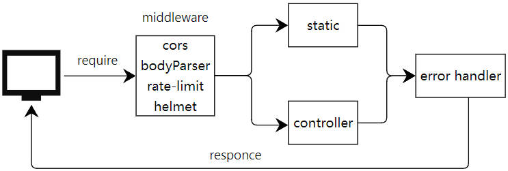

<a href="./README_en.md" style="text-decoration: none;">
<a href="./README.md" style="text-decoration: none;">
<a href="https://github.com/chenmeilong/FileMaster-frontend" style="text-decoration: none;">
<a href="https://github.com/chenmeilong/FileMaster-backend" style="text-decoration: none;">

## API
- fm/foldertree：获取根目录开始的文件夹树，不包含文件
- fm/folder：获取指定目录下所有文件，包含文件夹和文件，不包含子目录下的文件
- fm/all：获取指定目录下所有文件，包含文件夹和文件，包含子目录下的文件
- fm/rename：文件或文件夹重命名
- fm/createfile：创建文件
- fm/createfolder：创建文件夹
- fm/delete：删除指定文件
- fm/copy：复制指定文件到指定目录
- fm/move：移动指定文件到指定目录
- fm/emptydir：清空指定目录下使有文件和文件夹
- fm/unzip：解压缩
- fm/archive：压缩文件和文件夹
- fm/duplicate：快速复制
- fm/saveimage：保存图片
- fm/upload：上传文件
- uploads：静态资源托管

## 快速上手

1. 安装依赖环境
> `pnpm i`   or `yarn`  or  `npm i` 

2. 启动项目
> `pnpm start`  or `yarn start`  or  `npm start` 

## 请求流程图

## 待办
- [X] 优化目录树查找结构，提升目录树查询效率
- [X] 根据开发环境和生产环境的区分，全局错误中间件
- [X] 文件批处理，将所有的异步对象放在数组中，使用promise.all处理。
- [ ] 更加详细的类型定义
- [ ] 文本文件编辑后保存API
- [ ] 文件搜索API
- [ ] 上线npm完善安装使用文档

## 贡献
欢迎PRs！如果你想为这个项目做贡献，你可以提交pr或issue，[待办](#待办)中有一些可以扩展的功能。我很高兴看到更多的人参与改进并优化它。